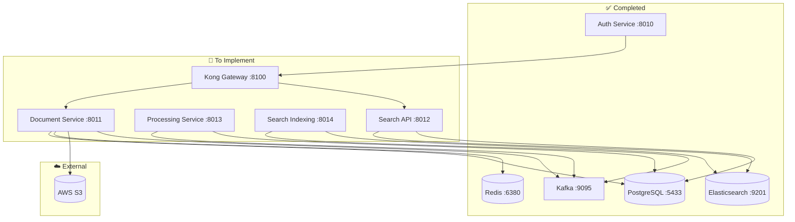

# Backend Services Documentation
## Phase 2: Core Backend Services Implementation

Welcome to the comprehensive documentation for implementing the remaining 80% of Phase 2 backend services for the Medical AI Search Platform.

---

## 📚 Documentation Overview

This documentation package provides everything needed to complete Phase 2 and prepare for AI/ML integration:

### 🎯 **[Phase 2 Implementation Guide](phase2-implementation-guide.md)**
**Complete step-by-step implementation guide covering:**
- 8-10 day implementation timeline
- Detailed service architecture
- Code examples and configurations
- Database schemas and API endpoints
- Event-driven workflow setup
- Testing strategies and validation

### 📋 **[Service Specifications](service-specifications.md)**
**Detailed technical specifications for each service:**
- Document Management Service (Port 8011)
- Content Processing Service (Port 8013)  
- Search Indexing Service (Port 8014)
- Search API Service (Port 8012)
- Kong Gateway Configuration (Port 8100)
- Complete API documentation with examples
- Database schemas and relationships
- Elasticsearch configurations

### ✅ **[Deployment Checklist](deployment-checklist.md)**
**Comprehensive validation and testing guide:**
- Pre-implementation requirements
- Step-by-step validation checklist
- End-to-end workflow testing
- Performance benchmarking
- Error handling validation
- Production readiness criteria

---

## 🏗️ Current Architecture Status

### ✅ **Completed (20%)**
- **Authentication Service** - User registration, login, JWT, RBAC
- **Infrastructure** - PostgreSQL, Redis, Kafka, Elasticsearch, Kong

### 🚧 **To Be Implemented (80%)**
- **Document Management Service** - File upload, S3 storage, metadata
- **Content Processing Service** - PDF extraction, medical NER
- **Search Indexing Service** - Elasticsearch indexing
- **Search API Service** - Multi-modal search capabilities
- **API Gateway Integration** - Kong routing and security

---

## 🎯 Implementation Sequence

### **Week 1: Core Document Pipeline**
1. **Days 1-2**: Document Management Service
2. **Days 3-4**: Content Processing Service
3. **Day 5**: Kafka Event Integration

### **Week 2: Search & Integration**
4. **Days 6-7**: Search Infrastructure & API
5. **Days 8-9**: API Gateway & Service Integration
6. **Day 10**: Testing & Performance Optimization

---

## 🔄 Service Dependencies



---

## 📋 Quick Start Guide

### 1. **Review Current Status**
```bash
# Verify all infrastructure is running
cd backend
docker-compose -f docker-compose.dev.yml ps

# Test auth service
curl http://localhost:8010/health
```

### 2. **Follow Implementation Guide**
- Start with **[Phase 2 Implementation Guide](phase2-implementation-guide.md)**
- Use **[Service Specifications](service-specifications.md)** for detailed technical requirements
- Validate progress with **[Deployment Checklist](deployment-checklist.md)**

### 3. **Implementation Order**
1. Document Management Service (most critical)
2. Content Processing Service (enables AI/ML)
3. Search Infrastructure (search foundation)
4. API Gateway Integration (production ready)
5. End-to-end testing and optimization

---

## 🎯 Success Criteria

### **Technical Validation**
- [ ] All 5 services running and healthy
- [ ] Complete document upload → processing → indexing → search workflow
- [ ] Authentication working across all services  
- [ ] Event-driven communication functioning
- [ ] Search returning relevant results
- [ ] Performance targets met (see deployment checklist)

### **Phase 3 Readiness**
- [ ] Document content available for AI processing
- [ ] Search infrastructure ready for vector embeddings
- [ ] Event system ready for AI workflow triggers
- [ ] API endpoints ready for AI enhancement
- [ ] Monitoring and logging in place

---

## 🔧 Development Environment

### **Current Infrastructure**
- **PostgreSQL**: localhost:5433 (user: postgres, pass: password)
- **Redis**: localhost:6380
- **Kafka**: localhost:9095
- **Elasticsearch**: http://localhost:9201
- **Auth Service**: http://localhost:8010

### **Planned Service Ports**
- **Document Management**: localhost:8011
- **Content Processing**: localhost:8013
- **Search Indexing**: localhost:8014
- **Search API**: localhost:8012
- **Kong Gateway**: localhost:8100

---

## 📊 Key Features Being Implemented

### **Document Management**
- PDF upload and validation (up to 50MB)
- S3 storage with versioning
- Metadata extraction and storage
- Access control and permissions
- File integrity verification

### **Content Processing**
- PDF text extraction with OCR support
- Medical entity recognition (diseases, drugs, procedures)
- Document structure analysis
- Quality scoring and assessment
- Citation and reference parsing

### **Search Infrastructure**
- Medical-specific Elasticsearch analyzers
- Synonym expansion for medical terms
- Faceted search and filtering
- Search suggestions and autocomplete
- Performance optimization

### **API Gateway**
- Unified API access point
- JWT authentication across services
- Rate limiting and security policies
- Request/response logging
- Circuit breaker patterns

---

## 🚀 Why This Foundation Matters for AI/ML

The Phase 2 backend services create the essential foundation for Phase 3 AI/ML integration:

1. **Document Management** → Provides documents for AI processing
2. **Content Processing** → Extracts clean text for AI models
3. **Search Infrastructure** → Stores embeddings and enables retrieval
4. **Search API** → Interface that AI will enhance with RAG
5. **Event System** → Triggers AI processing workflows

Without these services, the AI/ML features cannot function effectively.

---

## 📞 Support and Troubleshooting

### **Common Issues**
- Port conflicts → See deployment checklist troubleshooting section
- Database connection issues → Check PostgreSQL configuration
- Service startup failures → Review Docker logs and dependencies

### **Performance Optimization**
- Monitor resource usage with `docker stats`
- Use health check endpoints for service monitoring
- Follow performance benchmarks in deployment checklist

### **Getting Help**
- Review service specifications for detailed API documentation
- Check deployment checklist for validation steps
- Use implementation guide for step-by-step instructions

---

## 🎯 Next Steps

1. **Start Implementation**: Begin with Document Management Service
2. **Follow the Guide**: Use the implementation guide step-by-step
3. **Validate Progress**: Use deployment checklist to verify each service
4. **Test End-to-End**: Ensure complete workflow functions
5. **Prepare for Phase 3**: AI/ML integration with solid backend foundation

The documentation is designed to be comprehensive yet practical, ensuring successful implementation of all Phase 2 backend services. Each document builds upon the others to provide a complete implementation roadmap.

**Ready to build the foundation for your medical AI platform? Start with the [Phase 2 Implementation Guide](phase2-implementation-guide.md)!** 🚀